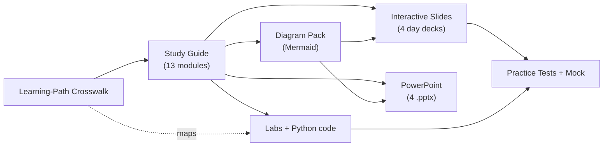

# AI-901 Faculty Development Programme Kit
### Microsoft Certified: Azure AI Fundamentals — complete, interactive teaching package

[-5b8cff)](slides/index.html)
[](pptx/)
[](https://learn.microsoft.com/credentials/certifications/exams/ai-901/)

A full, **interconnected** kit to *deliver* a 3-day AI-901 prep camp (07–10 Jul 2026): interactive slides, real PowerPoint decks, Mermaid diagrams, hands-on Foundry labs with runnable Python, a study guide, and hard practice tests + a full mock.

> **AI-901 replaced AI-900** (English update 15 Apr 2026; AI-900 retired 30 Jun 2026). It is a **ground-up redesign** built around **Microsoft Foundry**, **agents**, and **Azure Content Understanding**, and it now assumes **basic Python + SDK/REST** literacy. This kit is built against the current objectives, **not** the retired AI-900.

---

## 🚀 Start here
| I want to… | Go to |
|---|---|
| **Teach the sessions (present)** | [Interactive slides](slides/index.html) · or the [PowerPoint decks](pptx/) |
| **Plan the 3 days** | [Facilitator guide](study-guide/00-facilitator-guide.md) |
| **Learn / revise the content** | [Study guide modules](study-guide/) |
| **Run the hands-on labs** | [Labs](labs/README.md) + [starter code](labs/code/) |
| **Show a diagram on the whiteboard** | [Diagram pack](diagrams/README.md) |
| **Test the learners** | [Practice 1](study-guide/09-practice-test-1-hard.md) · [Practice 2](study-guide/10-practice-test-2-hard.md) · [Full mock](study-guide/11-full-exam-simulation.md) |
| **Confirm full syllabus coverage** | [Learning-path crosswalk](study-guide/13-learning-path-alignment.md) |

---

## 🗺️ How it all connects


Every artifact is aligned to the **two official Microsoft Learn paths** and the **AI-901 skills measured**:
- **Domain 1 — Identify AI concepts & capabilities (40–45%)**
- **Domain 2 — Implement AI solutions by using Microsoft Foundry (55–60%)**

---

## 📁 Repository structure
```
AI901_FDP/
├─ README.md                     ← you are here
├─ index.html                    ← course home (GitHub Pages landing)
├─ slides/                       ← interactive reveal.js decks + quiz engine
│  ├─ index.html  day3–day6.html  assets/{theme.css,quiz.js}
├─ pptx/                         ← real PowerPoint decks + generator
│  ├─ AI-901_Day3…6.pptx  build_pptx.py
├─ diagrams/                     ← Mermaid diagram pack (renders on GitHub)
├─ study-guide/                  ← 13 markdown modules (concepts → Foundry → tests)
├─ labs/                         ← hands-on lab guide
│  └─ code/                      ← runnable Python: chat_client, agent, analyze_text, extract_content
└─ .nojekyll
```

---

## 📅 3-day delivery at a glance
| Day | Focus | Slides | Labs | Test |
|---|---|---|---|---|
| **Day 3** (07-Jul) | Foundations, Responsible AI, Foundry, Vision | [day3](slides/day3.html) | Lab 1, Vision | Practice 1 Q1–20 |
| **Day 4** (08-Jul) | Text, Speech, Content Understanding | [day4](slides/day4.html) | Text, Speech, Lab 4 | Practice 1 Q21–40 |
| **Day 5** (09-Jul) | Generative AI, Agents, Foundry SDK | [day5](slides/day5.html) | Lab 2, Lab 3 | Practice 2 |
| **Day 6** (10-Jul) | Revision + Mock | [day6](slides/day6.html) | — | Full 50-Q mock |

Full minute-by-session plan: **[study-guide/00-facilitator-guide.md](study-guide/00-facilitator-guide.md)**.

---

## 🖥️ Using the interactive slides
- Open [`slides/index.html`](slides/index.html) locally, or publish via **GitHub Pages** (below).
- Keys: **→/Space** next · **←** back · **F** fullscreen · **O** overview · **S** speaker notes.
- **Click a quiz option** to reveal the correct answer + explanation. Mermaid diagrams render live.

### Publish on GitHub Pages (free hosting for the slides)
1. Push this repo to GitHub (see below).
2. Repo **Settings → Pages → Build from branch →** `main` / root.
3. Your site: `https://EricKart.github.io/AI901_FDP/` (course home) and `/slides/`.
The `.nojekyll` file ensures assets serve correctly.

---

## 🧪 Labs — quick start
```bash
pip install -r labs/code/requirements.txt
cp labs/code/.env.example labs/code/.env   # fill in after Lab 1
python labs/code/chat_client.py            # Lab 2
python labs/code/analyze_text.py           # text mini-lab
az login && python labs/code/agent.py      # Lab 3
```
Full instructions: **[labs/README.md](labs/README.md)**.

---

## 🏗️ Rebuild the PowerPoint decks
```bash
pip install python-pptx
python pptx/build_pptx.py     # regenerates the 4 .pptx files
```

---

## ✅ Exam facts
| | |
|---|---|
| Exam | **AI-901** — Microsoft Certified: Azure AI Fundamentals |
| Pass | **700 / 1000** (scaled) |
| Length | ~40–60 questions, ~45–60 min |
| Cost | ~$99 USD · certification **never expires** |
| Official study guide | https://aka.ms/AI901-StudyGuide |
| Register | https://learn.microsoft.com/credentials/certifications/exams/ai-901/ |

---

## 📝 License / use
Created for faculty development / educational use. Verify service names and objectives against the [official AI-901 study guide](https://aka.ms/AI901-StudyGuide) close to your exam date, as Microsoft updates Foundry frequently.

🤖 Generated with [Claude Code](https://claude.com/claude-code)
