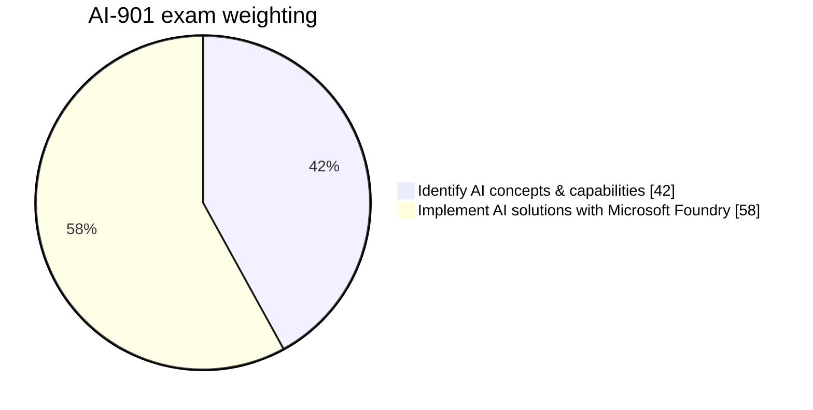
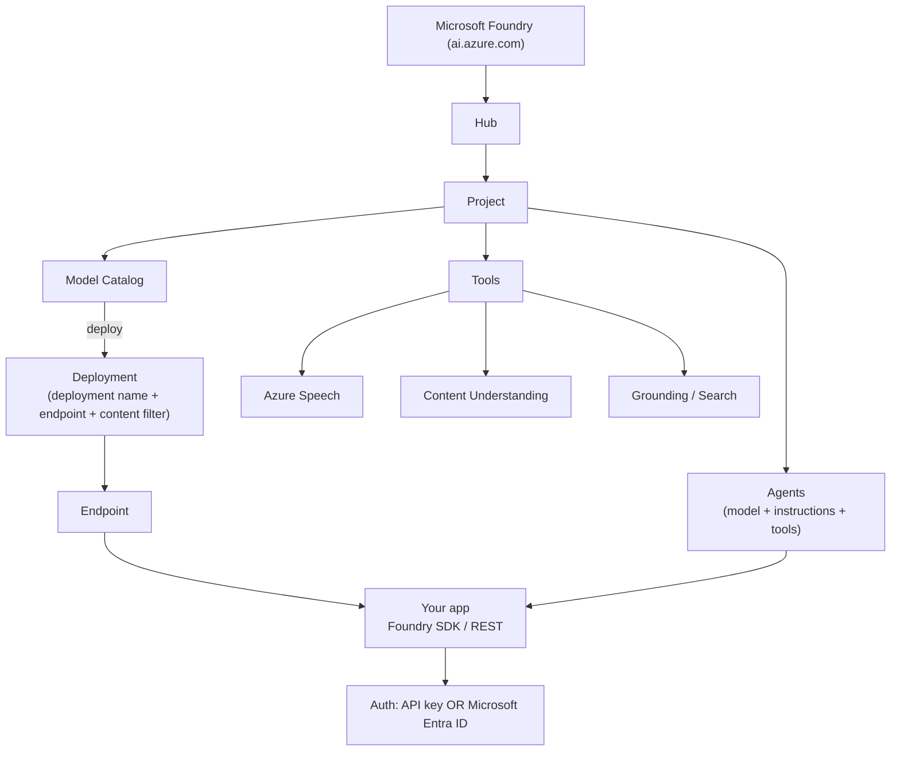
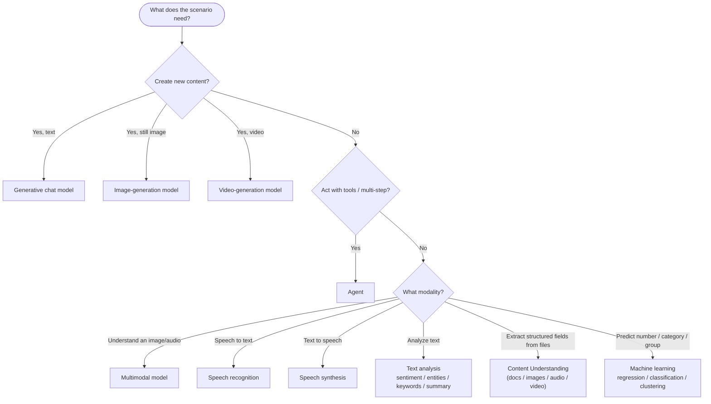
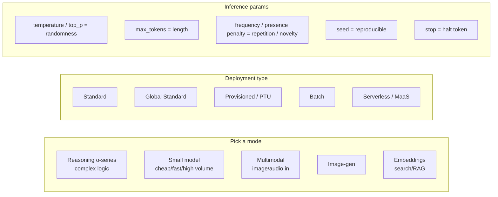
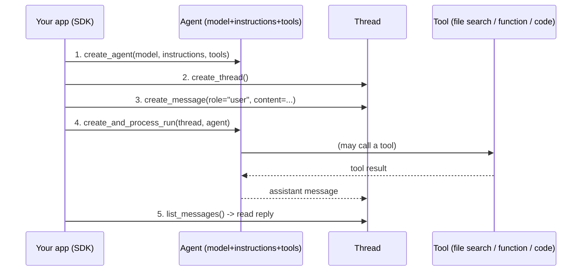
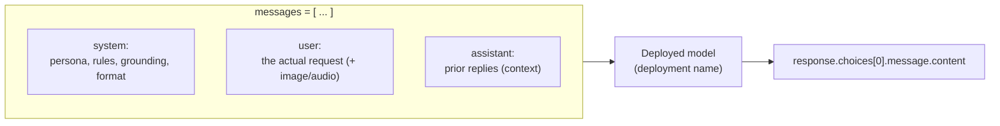
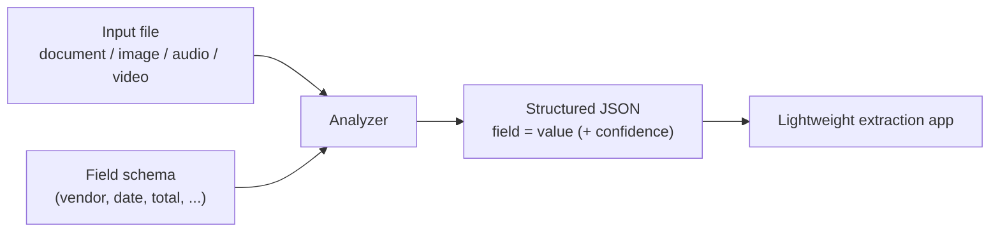
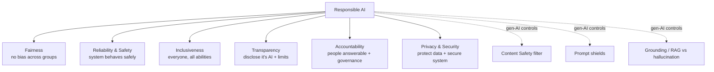

# AI-901 FDP — Diagram Pack (Mermaid)

All diagrams render automatically on GitHub and are embedded in the interactive slides. Use them as whiteboard references while teaching.

---

## 1. Course map — how everything connects
```mermaid
mindmap
  root((AI-901<br/>Azure AI Fundamentals))
    Domain 1 (40-45%)<br/>Identify concepts
      Responsible AI
        Fairness
        Reliability & Safety
        Privacy & Security
        Inclusiveness
        Transparency
        Accountability
      How GenAI works
        Tokens & Embeddings
        Transformers
        Model selection
        Deployment & config
      AI workloads
        Generative & Agentic
        Text analysis
        Speech
        Computer vision
        Information extraction
    Domain 2 (55-60%)<br/>Implement in Foundry
      Foundry portal & endpoints
      Deploy & prompt a model
      Foundry SDK chat client
      Agents (model+instructions+tools)
      Text & Speech in Foundry Tools
      Vision & image/video generation
      Content Understanding
```

---

## 2. Exam blueprint — weightings


---

## 3. Microsoft Foundry architecture


---

## 4. Workload decision tree — scenario → capability


---

## 5. Model selection & inference config


---

## 6. Agent lifecycle (Foundry Agent Service)


---

## 7. Chat request anatomy


---

## 8. Content Understanding flow


---

## 9. Responsible AI — anchor map (FRITAP)

